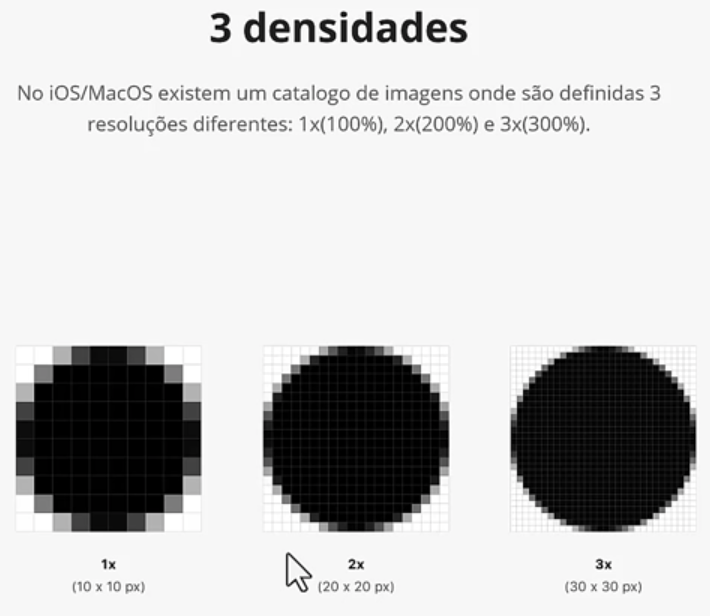
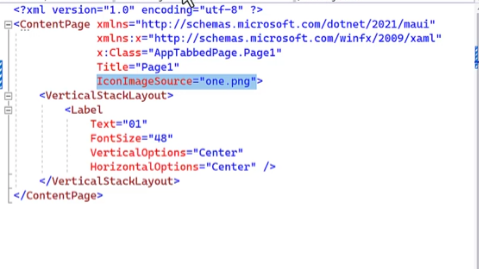

Criando projeto MAUI

É um unico projeto soportado por várias plataformas (Windows, iOS, Android, MAC)

pasta dependencias ficam os pacotes de cada plataforma
pasta propriedades tem um arquivo de configuração para inicilizar no windows
pasta plataforms tem arquivos nativos, de configuração, classes e recursos de cada plataforma
pasta recursos centraliza recursos do MAUI (fontes, icones, imagens, estilos)

fluxo de execução: começa a ser executado nas classes nativas de cada plataforma, main que chama o MAUI program

no MAUI program configura a classe a ser executada inicialmente, fontes que serão carregadas, injeções de dependências, etc
ou seja classe MAUIProgram e uma classe de configuração, dentro da classe pode ver qual é o proximo arquivo do fluxo por meio do metodo UseMauiApp que executa o App.xaml

conceito code behind: tem 2 arquivos um xaml para cuidar da interface da tela e um c# para cuidar da lógica
2 arquivos diferentes associados/vinculados

xaml linguagem de marcação da microsoft e uma variação do xml

MauiProgram chama app, onde tem o metodo InitializeComponent(); que le o xml e cria classes/objetos 

no app tem o MainPage que chama o AppShell(); no AppShell.xaml tem o content que chama um arquivo main page
no main page tem as tags que criam a tela (MainPage.xaml) e o código por trás da tela (MainPage.xaml.cs)

para alterar nome de exibição, versão, id, plataformas suportadas, etc pode ser em propriedades do projeto (.net vai replicar no arquivo de configuração de cada plataforma, ou pode configurar especificamente por plataforma)

ou clicando 2 vezes no projeto

pixel: menor unidade se tratando de tela, 3 pontos de luz (RGB) que cada 1 varia de 0 a 255, as telas são compostas por milhares de pixels

pixel na intensidade máxima é branco, pixel desligado é preto, variação na intensidade nos 3 pontos (cada um com sua intensidade) e o que define a cor do pixel
pixel e um elemento dentro da resolução ou seja resolução e um conjunto de pixels dispostos entre linhas e colunas, quanto mais resolução mais pixels e maior qualidade de imagem

densidade é um conjunto de pixels dispostos em colunas e linhas, a unidade de medida utilizada é a polegada (2,54 centímetros)

no android

iOS

windows

alterar icone

para realmente alterar o icone ir em limpar e desinstalar o aplicativo ja criado

caminho icones C:\Users\alici\Documents\csharp\NumeroDaSorte\NumeroDaSorte\obj\Debug\net8.0-windows10.0.19041.0\win10-x64\resizetizer\r
por ser svg ele consegue criar variações com dimensões sem perder a qualidade

alterando icone somente no android 

include = plano de fundo, foregroundfile = acima da plano de fundo, tintColor = pinta o foregroundfile, color = pinta o include, foregroundscale = redimenciona o foreground, 
basesize = tamanho original e ele usa esse tamanho para redimencionar, resize = valor bool sim ou não para dizer se quer que a imagem redimencione ou não (padrão sim)

splashScreen = tela de carregamento (somente nos celulares)

content page c# cria somente um arquivo c# content page xaml cria o xaml e o c#

componentes podem ser divididos em 3 grupos: 
páginas: as telas, página, navegação, menus laterais, etc ex: ContentPage
layout: posicionamento dos elementos, componentes de layout ex: VerticalStackLayout
interação com o usuário: textos, imagens, botões, compos de entrada de texto ex: Label

estilos ficam configurados nesses arquivos, colors ficam as cores principais e styles os estilos aplicados aos componentes, mas também podem ser aplicados no proprio xaml

arquivo styles 
estilos no proprio xaml 

x:Name="" dando nome a um componente

sobre xaml

tipos de páginas: (todos os tipos de páginas podem trabalhar em conjunto)

ContentPage = tela de conteudo, a página mais básica e utilizada que existe no MAUI, como o nome diz é uma página de conteúdo. toda a tela do seu aplicativo vai precisar ser construida com contentpage
NavigationPage = navegação com tela de conteudo, página de navegação, oferece uma estrutura de navegação para abrir e fechar páginas além de adicionar uma navigationBar
FlyoutPage = navegue entre as telas menu lateral, o famoso menu lateral (Drawer), que mais oferece opções de acesso
TabbedPage = navegue entre as telas utilizando abas, apresenta as telas no estilo abas, acessadas por seções na parte inferior

title é da contentpage mas só é visivel ao usar navigationpage

para criar um navigationpage precisa instanciar ela e passar a primeira página que vai ser apresentada

ao clicar no botão na page1 gera o evento de click que executa a função Navigation.PushAsync(new Page2()); que muda para a page2, só da pra usar essa função se o navigationpage tiver sido instanciado anteriormente

se clicar em voltar destroi a página 2 e volta para a página 1 que ficou guardada na memoria 
navigation.popasync(); volta para a página anterior, se não tiver página anterior gera uma exceção
pesquisar modalstack e navigation stack
navigation.poptorootasync(); volta para a primeira página

FlyoutPage é uma página de conteudo na lateral de uma página central
para transformar uma contentpage em uma FlyoutPage precisa alterar no xaml para FlyoutPage e no c#(code behind) também

FlyoutPage não aceita conteudo apenas páginas e as páginas que aceitam o conteudo

atribuindo o namespace do projeto para acessar as outras páginas, deixando a página menu como menu e a page1 como primeira página

propriedade FlyoutLayoutBehavior="popover" = deixa o menu escondido e precisa clicar para abrir, só precisa em telas maiores
evento de click no botão do menu que chama a página flyout e o detail onde tem a page1 configurada como primeira página

nos celulares por padrão o menu fica "invisivel" sendo necessário puxar o menu para ele aparecer
para aparecer nos celulares precisa colocar as páginas dentro de navigationpage, assim aparece o botão do menu

TabbedPage também precisa transformar em um TabbedPage, precisa incluir o namespace do projeto para chamar as páginas

chamado as páginas no arquivo

especificando em qual arquivo vai iniciar 

ao clicar nas abas ja altera

BarBackground = troca a cor da barra de fundo podendo usar combinações de cores/degrade
BarBackgroundColor = trocar a cor da barra de fundo para uma cor sólida
SelectedTabColor = muda a cor de fundo do elemento selecionado no momento, comportamento vária de sistema operacional
UnselectedTabColor = muda a cor de fundo dos elementos que não estão selecionados
BarTextColor = altera a cor dos textos evitar usar no android
alterando icone das páginas na barra (mesmo o arquivo estando em svg melhor colocar em png):

tipos de layout

StackLayout = posiciona os elementos filhos em uma pilha horizontal ou verticalmente, VerticalStackLayout, HorizontalStackLayout
Grid = organiza os elementos dentro de uma estrutura de tabelas com linhas e colunas, pode estar um elemento em cima do outro, dimensionamento com valores fixos ou porcentagens
AbsoluteLayout = tem o poder de colocar o elemento onde quiser, baseado em regras de posicionamento e tamanho
FlexLayout = permite que os elementos responsivos dentro de um container sejam organizados automaticamente, dependendo do tamanho da tela

ContentPage só suporta um elemento por vez e ele ocupa todo o tamanho da tela, por isso precisa escolhe um layout principal e colocar os elementos dentro do layout
stacklayout
