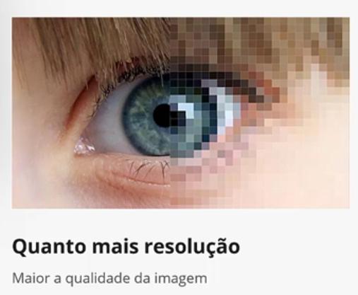

Criando projeto MAUI

É um unico projeto soportado por várias plataformas (Windows, iOS, Android, MAC)

pasta dependencias ficam os pacotes de cada plataforma
pasta propriedades tem um arquivo de configuração para inicilizar no windows
pasta plataforms tem arquivos nativos, de configuração, classes e recursos de cada plataforma
pasta recursos centraliza recursos do MAUI (fontes, icones, imagens, estilos)

fluxo de execução: começa a ser executado nas classes nativas de cada plataforma, main que chama o MAUI program

no MAUI program configura a classe a ser executada inicialmente, fontes que serão carregadas, injeções de dependências, etc
ou seja classe MAUIProgram e uma classe de configuração, dentro da classe pode ver qual é o proximo arquivo do fluxo por meio do metodo UseMauiApp que executa o App.xaml

conceito code behind: tem 2 arquivos um xaml para cuidar da interface da tela e um c# para cuidar da lógica
2 arquivos diferentes associados/vinculados

xaml linguagem de marcação da microsoft e uma variação do xml

MauiProgram chama app, onde tem o metodo InitializeComponent(); que le o xml e cria classes/objetos 

no app tem o MainPage que chama o AppShell(); no AppShell.xaml tem o content que chama um arquivo main page
no main page tem as tags que criam a tela (MainPage.xaml) e o código por trás da tela (MainPage.xaml.cs)

para alterar nome de exibição, versão, id, plataformas suportadas, etc pode ser em propriedades do projeto (.net vai replicar no arquivo de configuração de cada plataforma, ou pode configurar especificamente por plataforma)

ou clicando 2 vezes no projeto

pixel: menor unidade se tratando de tela, 3 pontos de luz (RGB) que cada 1 varia de 0 a 255, as telas são compostas por milhares de pixels

pixel na intensidade máxima é branco, pixel desligado é preto, variação na intensidade nos 3 pontos (cada um com sua intensidade) e o que define a cor do pixel
pixel e um elemento dentro da resolução ou seja resolução e um conjunto de pixels dispostos entre linhas e colunas, quanto mais resolução mais pixels e maior qualidade de imagem

densidade é um conjunto de pixels dispostos em colunas e linhas, a unidade de medida utilizada é a polegada (2,54 centímetros)

no android

iOS

windows

alterar icone

para realmente alterar o icone ir em limpar e desinstalar o aplicativo ja criado

caminho icones C:\Users\alici\Documents\csharp\NumeroDaSorte\NumeroDaSorte\obj\Debug\net8.0-windows10.0.19041.0\win10-x64\resizetizer\r
por ser svg ele consegue criar variações com dimensões sem perder a qualidade