linguagem da microsoft, open source de alto nivel(mais perto da linguagem humana), se destina a ser simples moderna e economica (consumo de memoria e processamento)

pode ser usado em api, aplicativos windows, mac, android e ios, sites,

linguagem orientada a objetos, tudo e um objeto(bom para organização e reutilização)

c# possui um colector de lixo, garbage collector, que age automaticamente e não é necessário se preocupar em liberar memoria, ele mesmo limpa, limpa partes não referenciadas

linguagem tipada, precisa definir o tipo das váriaveis e o compilador valida (evita erros)

segurança, fornece um bom nivel de segurança para as aplicações

csharp vai ser compilado para CLR

gerenciamento de momória feito automaticamente

IDE = ambiente de desenvolvimento integrado, ajuda no desenvolvimento, compila, autocomplete, debug

//comentários

/\* \*/ comentário mais de uma linha

projeto = onde implementa os códigos (classes, funções, imagens, arquivos)

solution = container que vai agrupar os projetos que estão relacionados, quando abre a solution no visual studio ja abre todos os projetos dentro da solution

projeto do tipo console gera um executavel que abre um terminal, outros tipos de projetos geram coisas diferentes (como bibliotecas)

se na parte de executar o projeto não estiver aparecendo nada, nas váriaveis de ambiente (path) o com a pasta program files dotnet precisa estar acima da pasta x86 do dotnet

namespace = forma de organizar o conteudo dentro do projeto (classe, interface), classes podem ter nomes iguais desde que em namespaces diferentes, nome do namespace = nome do projeto,
se tiver mais pastas dentro do projeto faz a junção nome do projeto + nome da pasta exemplo: iniciandoCSharp.teste1,
em versões mais antigas do c# após o namespace precisa abrir {} e escrever o código dentro, em versões mais atuais não precisa e pode colocar ;
em opções, text editor, general, pode definir se prefere {} ou ; na criação do namespace

classe = molde para construir um objeto real, e esse molde define caracteristicas do objeto, exemplo: classe usuário, propriedade nome email telefone, também pode definir comportamentos que
podem ser transformados em funções

exemplo:
class Program
{

}

para escrever uma instrução/passo a passo no código escreve uma função, ao criar função precisa pensar se ela precisa devolver algum valor ou não, função sem devolver valor e void,
os nomes precisam ser significativos e é case sensitive
projeto console aplication ao ser executado ele vai procurar a função Main para iniciar o projeto

exemplo:
static void Main() //função Main dentro da classe
{
Console.WriteLine("Ola, mundo!");
//Console. = abre o console e WriteLine = escreve uma linha, texto sempre em ""
}

para usar uma função em outra classe precisa instanciar um objeto da classe dentro da outra

exemplo: Carro meuCarro = new Carro(); criando o objeto Carro dentro da variavel meuCarro do tipo Carro

objeto = meuCarro, tipo = Carro, que é uma instancia/objeto da classe carro

para poder usar a função em outra classe precisa ter o public na frente, se estiver dentro de outro namespace ou pasta precisa usar o using iniciandoCSharp.teste1;

exemplo: public void Ligar()
{
Console.WriteLine("Carro ligado");
}

modificadores de acesso:

public = qualquer classe que tiver uma instancia dessa classe pode acessar essa função

private = somente a propria classe pode usar essa função

internal = somente classes que estão dentro do projeto podem acessar

se não colocar modificador de acesso na função vai ser private

classe só tem 2 modificadores, public ou internal, se não marca o padrão e internal

tipos númericos:
inteiro, diferença entre eles é o intervalo de números aceitos, tem outros tipos inteiros mas de exemplo esses:
int num = 7;
long num2= 7;
uint num3 = 7 (inteiro sem sinal,somente com números positivos);
int numero = 1_000 pode ser usado o underline para separar as casas dos números

ponto flutuante, decimais, utiliza ponto ao invés de vírgula, diferença e a precisão
double num = 3.14; (precisão 15 a 17)
float num2 = 3.14f (precisa colocar f senão ele reconhece o número como double, precisão 6 a 9);
decimal num3 = 3.14m (mesmo caso do f, precisão 28 a 29)

tipo booleano, falso ou verdadeiro
bool ativo = false;
bool ativo2 = true

texto, cada caracter tem uma numeração que começa em zero, espaço também e um caracter
char letra = 'a'; (somente 1 caracter)
string texto = " Alice "; (conjunto de caracter)
char primeiraLetra = texto[0];

string nomeSemEspaço = texto.Trim(); = tira espaço final e começo
bool começaCom = texto.StartsWith("A"); = retorna true ou false se começa com o caracter, é case sensitive, também tem o EndsWith
string troca = texto.Replace('A', '1'); = altera um caracter por outro, primeiro o caracter antigo, depois o novo
bool existe = texto.Contains('Ali'); = verifica se no texto contem o caracter ou conjunto de caracteres
bool existe = texto.Equals('Ali'); = verifica se é exatamente igual

string paragrafo = texto + " " + texto2 + " " + 7; concatenação
string paragrafo2 = $"A primeira frase: {texto} segunda frase {texto2} {7}"; outro modo de concatenar em versões mais novas
\n pula linha, \t um tab, para não dar o tab ou pular linha e \\t \\n ou coloca @ no inicio da string, @"C:\teste";
StringBuilder usado se for concatenar muitas strings e variaveis por questão de performance

string texto3 = "O usuário {0} gosta do numero {1}";
string resultado = string.Format(texto, "Alice", 7); vai formatar o texto e colocar nos valores 0 e 1 as informações colocadas no format em ordem, gera uma nova string

DateOnly dia = new DateOnly(2023,12,1); resultado 01-Dec-23
string diaEmText = dia.ToShortDateString(); resultado 01-Dec-23
string diaEmText = dia.ToLongDateString(); resultado Friday, December 1, 2023
string diaEmText = dia.ToString(new CultureInfo("pt-BR")); resultado 01/12/2023
string diaEmText = dia.ToString("d", new CultureInfo("pt-BR")); resultado sexta-feira, 1 de dezembro de 2023, mais formatos na documentação
string diaEmText = dia.ToString("dd MMMM yyyy", new CultureInfo("pt-BR")); resultado 1 dezembro 2023

DateTime dia = new DateTime(2023,12,1, 20, 07, 1); data e hora, primeiro as horas depois os minutos depois os segundos
DateTime hoje = DateTime.Now; pega a hora e data atual do servidor
DateTime hoje = new DateTime.Today; pega somente a data e por padrão vem hora meia noite
DateTime hoje = new DateTime.UtcNow; pega a hora universal ainda sendo possivel calcular para ver a hora da maquina do usuário utc=gmt

enum, variavel com mais de uma opção, define os valores possiveis e escolhe uma opção, precisa criar fora da função, pode dar um número para o valor, não precisa ser em sequencia, 
mas precisam ser positivos e não podem ser duplicados

criar:
enum NiveldeDificuldade
{
    Baixo = 0,
    Medio = 1,
    Alto = 2
}

escolher: NiveldeDificuldade nivel = NiveldeDificuldade.Medio;

tipo var, deixa o compilador selecionar o tipo de variavel, sempre precisa passar um valor na declaração
var valor = "Alice";
var valor2 = 13;

object, é um tipo de dados que pode apontar para qualquer tipo de dados

a palavra-chave var define uma variável local com um tipo implícito, enquanto object é um tipo de referência que serve de base para todos os outros tipos

null, representar a ausência de um valor ou referência em tipos que podem aceitar valores nulos, para valores numericos precisa colocar ? no tipo da variavel
int? idade = null;
HasValue é usada para verificar se uma variável de tipo anulável contém um valor ou é null, resultado true se tiver valor ou false se for null
Value retorna o valor armazenado em uma variável anulável, se ela não for null, se for null e usar o value retorna uma exceção

array variaveis para armazenar coleção de valores do mesmo tipo, acesso pelas posições, primeira posição sempre é zero, tamanho fixo (pode aumentar ou diminuir mas e muito custoso para o computador fazer)
int[] inteiros = new int[10]; array de int com tamanho 10, posições 0 até o 9
Console.WriteLine(inteiros.Length); ver tamanho do array
inteiros[0] = 1; primeira posição valor 1
int[] inteiros = [1,2,3]; quando ja sabe os valores do array, tamanho do array 3
int[,] inteiros2 = new int[10,10]; array de duas dimensões, 10 linhas por 10 colunas, podem ter mais dimensões
inteiros2[0,0] = 2; valor 2 na linha 0 coluna 0
inteiros2[0,3] = 5; valor 5 linha 0 coluna 3
por default se não colocar valor fica 0

lista, variavel para armazenar coleções de valores do mesmo tipo, mas não tem tamanho fixo, também tem posições e começa com 0, tem somente 1 dimensão
List<int> lista = new List<int>();
Console.WriteLine(lista.Count); ver tamanho da lista
lista.Add(5); adicionar elemento a lista
lista.Remove(5); remover elemento da lista passando o valor, se tinha um elemento depois ele assume a posição do elemento removido
lista.RemoveAt(0); remover elemento passando a posição
lista.Clear(); remove todos os elementos
acessar elemento: lista[0] passa a posição, lista.First() primeiro elemento, lista.Last ultimo elemento, lista.ElementAt(0) passa a posição
string resultado = string.Join(" ",lista); juntar uma lista em uma string so, passa a lista e o que vai ser usado de separação

pode ter lista de instancia de classe
lista de objetos pode receber valores de tipos diferentes

dicionario, para cada chave tem um valor associado, chaves precisam ser valores unicos não pode duplicar
Dictionary<int, string> dicionario = new Dictionary<int, string>(); chave de valor inteiro e elemento string
dicionario.Add(1, "Alice"); adicionando chave e valor
dicionario[1]; acessa os valores pela chave  
dicionario.ContainsKey("Alice"); verifica se existe o valor, returna true ou false

HashSet, parecido com lista mas os valores precisam ser unicos, não da erro mas não adiciona o valor
HashSet<int> set = new HashSet<int>();
set.Add(1);
set.Add(5);
set.Add(1);
Console.WriteLine(set.Count); resultado é 2 pois não adicionou o valor

funções com parametros
função publica de retorno vazio, recebe 2 parametros que precisam ser passados ao chamar a função
public void Adicionar(int valor1, int valor2){ 
    var resultado = valor1 + valor2;
    Console.WriteLine(resultado);
}

chamando a função:
    var matematica = new OperacoesMatematicas();
    matematica.Adicionar(1,7);

    para melhor entendimento do código pode se passar parametros nomeados, com parametros nomeados pode alterar a ordem dos parametros passados
    matematica.Adicionar( valor1: 1, valor2: 7);

    sempre dar nome significativo para função e para as variaveis

função devolvendo valor precisa passar o tipo do resultado que será devolvido e passar o retorno com o return
public int Adicionar(int valor1, int valor2)
{
    return valor1+valor2;
}

se a função tem somente 1 linha de código ela pode ser resumida:
public int Adicionar(int valor1, int valor2) => valor1 + valor2;

public int Adicionar(int valor1, int valor2) => Console.WriteLine(valor1+valor2);

função que devolve mais de 1 valor
public (int,string) Adicionar(int valor1, int valor2)
{
    return (valor1 + valor2, "Alice");
}

Console.WriteLine(resultado.); acessando o primeiro valor retornado
Console.WriteLine(resultado.Item2); acessando o segundo valor retornado

passando nome para o retorno 
public (int resultadoAdicao,string autor) Adicionar(int valor1, int valor2)
{
    return (valor1 + valor2, "Alice");
}
 Console.WriteLine(resultado.resultadoAdicao);
 Console.WriteLine(resultado.autor);
 (int resultado, string nome) = matematica.Adicionar(1, 7); recebendo os valores em variaveis diferentes

para tornar um parametro opcional pode se passar um valor para ele na função, valores opcionais devem ser os ultimos da função, devem aparecer somente após os valores obrigatórios
public void Teste(int valor1, int valor2 = 7)
{
    Console.WriteLine(valor1 + valor2);
}

matematica.Teste(valor1:3); se não passar o valor2 ele vai por padrão 7, se passar o valor2 ele vai sobreescrever o valor 7

propriedades das classes precisam do get e set para poder acessar a variavel, get para recuperar o valor, set para passar um valor
public string Model {  get; set; }
pode ter uma variavel/propriedade com mesmo nome do tipo, mas não mesmo nome da classe
meuCarro.Model = "Lamborghini"; passando valor
Carro meuCarro = new Carro //passando valor na instanciação
{
    Model = "Lamborghini",
};
public required string Model {  get; set; } required deixa a propriedade obrigatória
mas para obrigar a passar o valor pode ser criado uns construtor para ser chamado sempre que instanciar a classe
public Carro(string model)
{
    Model = model;
}
Carro meuCarro = new Carro("Lamborghini");

static, significa que não está associado a uma instancia de uma classe, está associado somente com a classe
internal class OperacoesMatematicas
{
    public static int Somar(int valor1, int valor2) => valor1 + valor2;
}
var resuldadoSoma = OperacoesMatematicas.Somar(1, 2); executando a função

uma variavel static e compartilhada com todas as instancias, sempre vai ter o ultimo valor atribuido
uma função static não depende das propriedades da classe e de instanciar
uma classe static não pode ser instanciada e as funções são obrigatóriamente static

debug executa o código linha a linha, para clica na linha para gerar a bolinha vermelha que e a linha que vai iniciar o debug (breakpoint)
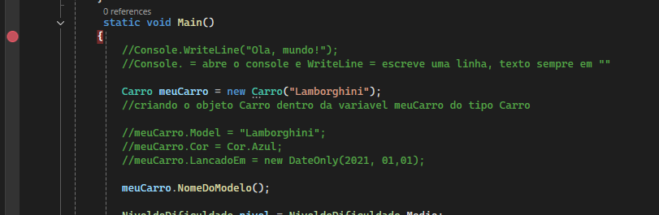

flexa amarela e onde o debug está executando e na parte supeior pode ir para frente ou f10, ao clicar em f10 executa a linha e vai para a proxima
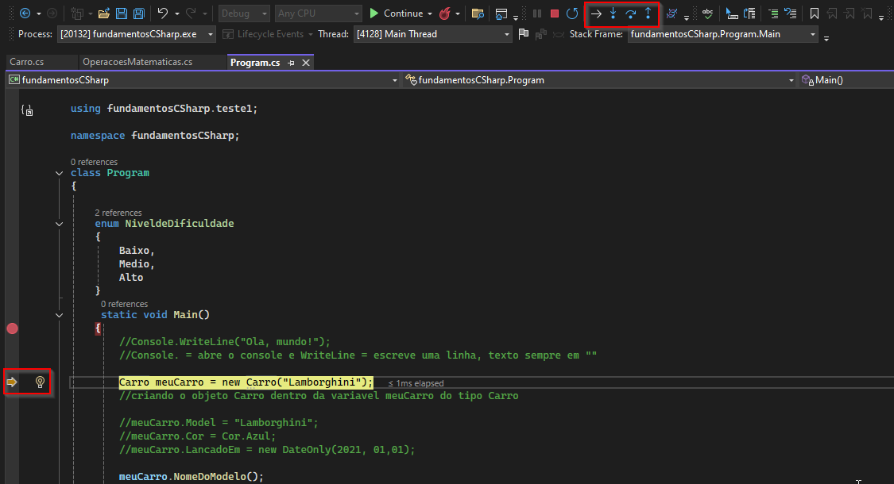

em baixo o valor da variavel ao executar
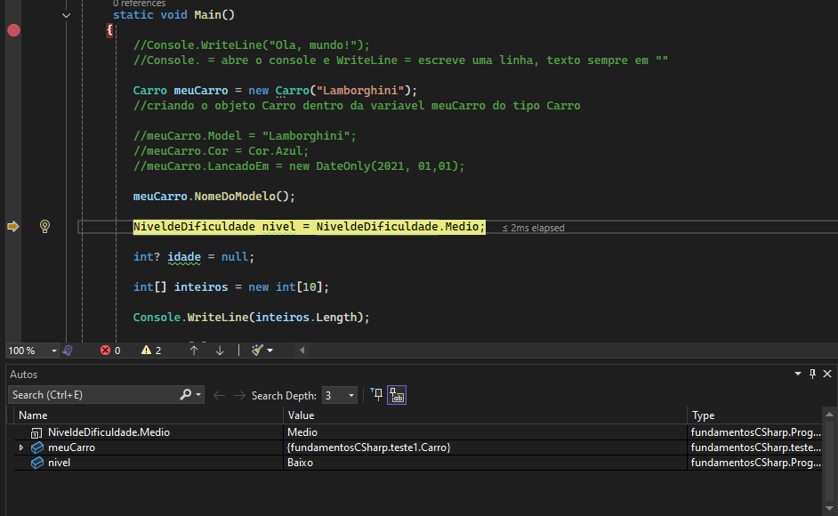

ao passar por uma função e clicar step into ou f11 ele vai abrir a função e debugar ela, step out ou shift f11 volta para o debug inicial

condicionais, if else, só executa só o código se determinada condição for atendidad/verdadeira, quando entra em um if ignora os outros, não pode ter elseif ou else sem o if
int num = 10;
if(num>0){ se atender a condição entra aqui
    Console.WriteLine("Numero positivo");
}
else if(num == 0){se não atender a condição do if entra aqui
    Console.WriteLine("Numero igual a zero");
}
else{  se não atender a condição do if nem do else if entra aqui
    Console.WriteLine("Numero negativo");
}

> maior
< menor
>= maior ou igual
<= menor ou igual
!= diferente
&& e (and) (todas as condições precisam ser verdadeiras)
|| ou (somente uma precisa ser verdadeira)
pode ser usado as condições em conjunto, inclusive && e ||

! na frente de valor booleano inverte o valor 
string.Equals validar se strings são iguais
!string.Equals validar se strings são diferentes
C# começa de cima para baixo da esquerda para a direita
.ToUpper(); deixa tudo em letras maiusculas
is null verifica se é nulo, is not null verifica se não é nulo
bom usar paranteses para separar quando for utilizado muitas condições, mas não e recomendado muitas condições

if ternario, se tem somente 2 alternativas se sim se não, pode ter mais de uma condição com && ou ||
int numero = 7;
string autor = numero == 7 ? "Alice": "Stephanie"; //se numero for igual a 7 primeira opção se não segunda
condição ?(se sim) primeiraOpcao :(se não) segundaOpcao;

switch recebe um parametro, caso condição for verdadeira entra no case, se não entra nos outros, se não entrar em nenhum entra no default
switch (nivel)
{
    case NiveldeDificuldade.Alto:
        {
            Console.WriteLine("Nivel alto");
        }
        break;

    case NiveldeDificuldade.Medio:
        { Console.WriteLine("Nivel medio"); }
        break;

    case NiveldeDificuldade.Baixo:
        {
            Console.WriteLine("Nivel baixo");
        }
        break;

    default:
        {
            Console.WriteLine("sem nivel");
            break;
        }
}

switch ternario, devolve um valor
int numero = 7;
string resultado = numero switch{
    7 => "Alice",
    >= 1 => "Stephanie, //maior igual a 1
    3 => "Malia",
    _ => "nome desconhecido" //default
};

loopings, após determinada condição executa o código n vezes

na condição for passa onde começa, ate onde vai/objetivo e quanto vai subir/aumentar/incrementar em cada looping ate chegar ao objetivo
for(int i = 0; i <10 ; i++) //ii++ igual a i = i + 1
{ //começa em 0 valida se atende a condição(menor que 10) se não atingir a condição incrementa, quando chegar a 9 que é menor que 10 para de incrementar e executar
    Console.WriteLine("contador:"+i);
}

para coleção de valores tem o foreach, ele ja percorre a lista e dentro de item passa o resultado do elemento da lista
var lista2 = new List<string> { "Alice", "Stephanie", "Soares", "Ribeiro" };
foreach (var item in lista2)
{
    Console.WriteLine(item);
}

while, enquanto a condição for verdadeira executa o código, precisa fazer a condição ter fim se não executa infinitamente
int num1 = 0;
while (num1 < 10)
{
    Console.WriteLine(num1);
    num1++;
}

do while, diferença do while e que ele executa o código e depois valida a condição ou seja executa o código pelo menos 1 vez
int num2 = 10;
do
{
    Console.WriteLine("teste"); //vai executar pelo menos 1 vez
    num2++;
}while (num2 < 10);

para forçar um looping a parar antes de chegar a condição de parada pode ser usado o break (break do switch e exceção a regra)
int num3 = 0;
while(num3 < 10){
    if (num3 == 5)
    {
        break;
    }
    Console.WriteLine(num3);
    num3++;
}

continue pula o código que tem abaixo e volta no inicio do looping
int num3 = 0;
while(num3 < 10){ //nesse caso volta para o while
    num3++;
    if (num3 == 5)
    {
        continue; // quando chega aqui volta para o while
    }
    Console.WriteLine(num3); //quando for 5 não imprime o num3
}

return além de retornar o valor na função também pode parar o looping como o break, break para somente o looping
diferença e que o break so pode ser usado em looping (switch exceção), return pode ser usado em funções
static string Teste(int num)
{
    Console.WriteLine("teste1");
    if (num == 5)
    {
        Console.WriteLine("teste2");
        return "Alice";
    }

    Console.WriteLine("teste3");
    return "Stephanie";
}

c# = linguagem de programação, .net = plataforma que reune varias bibliotecas, podemos criar aplicativos utilizando bibliotecas já existentes, estendendo seu comportamento ou desenvolvendo nossas próprias bibliotecas.
O .NET é composto por várias bibliotecas escritas em C#, mas também suporta outras duas linguagens, F-Sharp e Visual Basic. Além disso, o .NET oferece recursos como código assíncrono, funções lâmbidas e LINQ

versões do .NET: existem versões LTS com suporte de três anos e versões STS com suporte de 18 meses

.net framework somente windows, .net core multiplataforma (lançado em 2014), a partir de 3.1 mudou para apenas .net versão 5, versão nova sempre em novembro

quando executa o projeto (f5) é feito a build do projeto e depois executa o projeto
build = verifica se não tem erro de sintaxe no projeto, se as funções existem, ponto e virgula, etc. se tudo está correto transforma o código escrito em c# em outro arquivo com a extensão .dll, esse arquivo e 
transformado em outra linguagem chamada de linguagem intermediaria (IL), linguagem compacta, leve e independente da plataforma/arquitetura, código feito em windows na linguagem intermediaria funciona em linux por exemplo,
após a conversão executa o código,O Common Language Runtime (CLR) converte o código de linguagem intermediaria em código nativo e assim leva em consideração a arquitetura, quando converte em código nativo ele executa
e mostra o resultado, cada sistema operacional tem sua clr

arquivo .dll e .exe
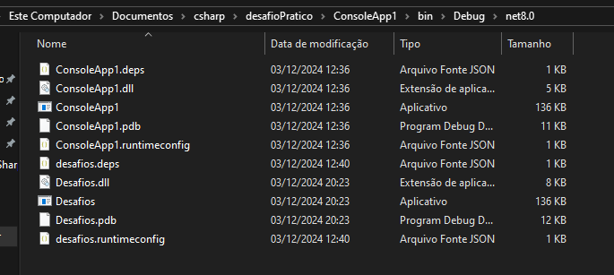

em projeto do tipo console tem as 2 opções
JIT just in time = compilador que vai transformar apenas em tempo de execução a dll para um código nativo .dll
AOT ahead-of-time = compila o código ja para a linguagem nativa .exe

CLI Interface de Linha de Comando, criar e executar projetos usando comandos na linha de comando,  comandos básicos, como new, restore, build, publish, run e test, mais usado para scripts
melhor explicação na documentação
new cria projeto, run executa
build verifica se está faltando dependencias erro de sintaxe e se tudo estiver ok compila o projeto na linguagem intermediaria 

api = conjunto de contratos e ferramentas para criação de software, permite que diferentes sistemas se comuniquem e troquem dados, um intermediador que processa as requisições do aplicativo e se conecta ao banco de dados de forma segura

protocolo http, protocolo de transferencia de hypertexto, comunicação cliente e servidor, O cliente envia uma solicitação ao servidor, que processa essa solicitação e envia uma resposta de volta ao cliente
independente de linguagem, usuário interage com uma página web o navegador(cliente) envia uma solicitação ao servidor, o servidor processa e envia de volta ao cliente
o protocolo http faz a chamada a url, O protocolo HTTP define os cabeçalhos da requisição, que podem conter informações complementares, e o corpo da mensagem, que contém os dados enviados pelo cliente.
métodos HTTP, como GET, POST, PUT e DELETE, que definem as ações que podem ser executadas na API
SSL protocolo de criptografia, garante a comunicação segura entre cliente e servidor, transporta os dados de forma segura(criptografado), https segue http e usa o ssl para criptografar

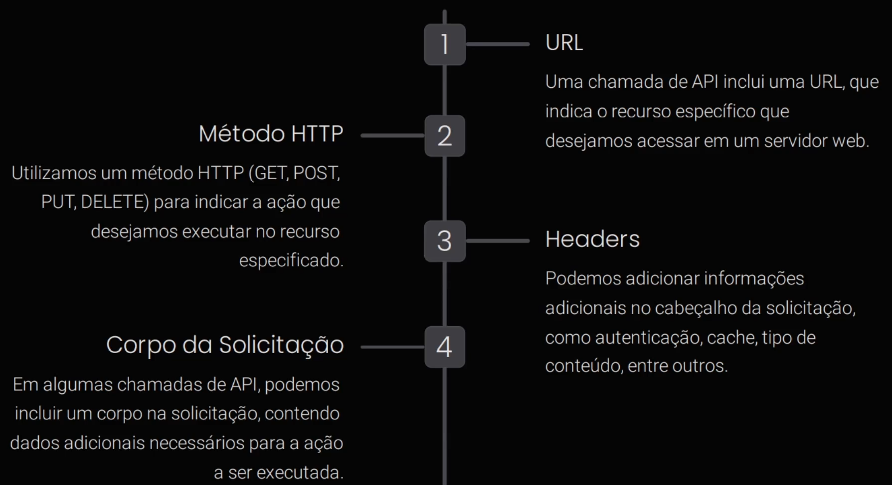
acessa uma funcionalidade da api atravez de uma chamada em uma url, na url tem um endpoint que tem as funcionalidades
a chamada utiliza um metodo http, get = recuperar informações, post = criar informações, put = atualizar informação ja existente, delete = deletar informação
header = passa informações simples (idioma, tipo de resposta, chaves de acesso, etc)
corpo da mensagem = passa informações importantes (informações do usuário)

a api pode devolver também header e corpo da mensagem ou somente um status code(codigo que indica se a solicitação foi bem sucedida, erro, etc), sempre precisa passar o código

depois de fazer a chamada a api precisa extrair os dados relevantes da resposta para serem utilizados no aplicativo

principais códigos, todo código da familia 200 retorna sucesso, 400 retorna erro, 500 erro desconhecido
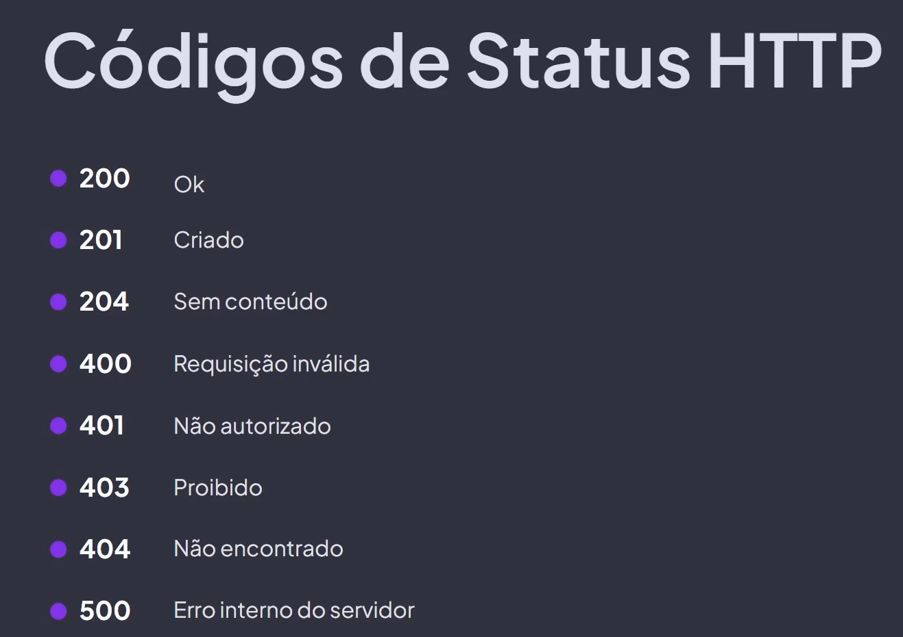

operações http básicas

get

não da pra enviar corpo da requisição no c#, algumas linguagens aceitam mas não é comum, pode passar informações na url ou no header

put 

payload = conjunto de url, metodo, header e corpo da requisição

post, criar recursos, código de status 201, igual o put mas cria um novo dado(post) ao invez de atualizar um existente(put)

delete

o que é json, formato para troca de dados
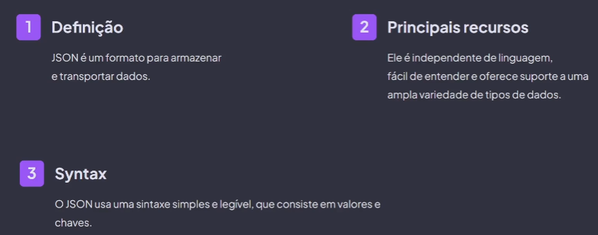

tipos de dados suportados
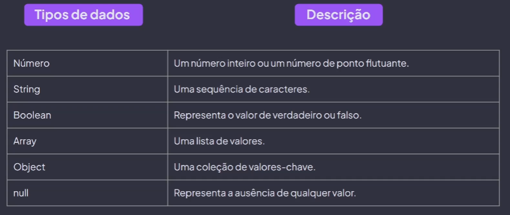

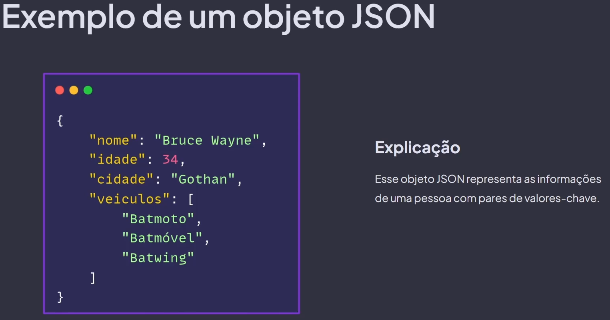

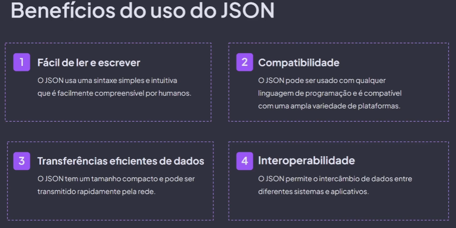

api rest, estilo arquitetural usado em sistemas web, para ser uma api rest precisa seguir algumas regras, como comunicação precisa ser http, cada recurso da api está associado a uma url, precisa ser stateless

api stateless tem memoria de curto prazo, após processar a requisição a api "esquece" o que ela fez, não guarda nenhum estado, processa a requisição sem referencia a requisição interior.
outra regra deve ter clara definição do que faz parte do cliente e do servidor, exemplo cliente não precisa saber como o servidor funciona

restful = serviço web que segue os princípios do rest

crud = create(criar um novo dado) read(ler um dado) update(atualizar um dado) e delete(deletar um dado)
onpremise = servidor proprio do cliente

projeto api visual studio code
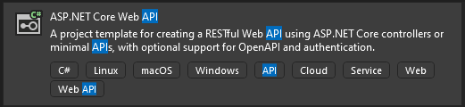

explicando projeto
em properties tem o arquivo launchSettings.json que armazena configurações para o modo debug
modo debug = não é otimizado para performance, da para fazer o debug colocando um breakpoint
modo release = código final com foco na performance, otimiza o código
Podemos trocar entre os perfis de execução no Visual Studio e personalizar as configurações conforme necessário.

program.cs = classe entrypoint, ponto de entrada do projeto, quando executa a api ele executa as linhas desse arquivo, nele, configuramos os controles, endpoints e o Swagger, que é uma ferramenta para documentar os endpoints da AP

appsettings.json = arquivo no formato JSON, armazenar informações privadas, como dados de conexão com bancos de dados ou chaves de serviços externos, É importante não incluir essas informações no código, pois elas são confidenciais e podem variar de acordo com o ambiente de desenvolvimento.
acessa as proprieades do arquivo em program pelo builder.Configuration

controller = dentro da pasta fica a classe controller, dentro dessa classe vão ficar funções/endpoints, um endpoint para cada funcionalidade especifica, controller vai ser o agrupamento de endpoints que tem relação

add controller e para api precisa ir na parte de api
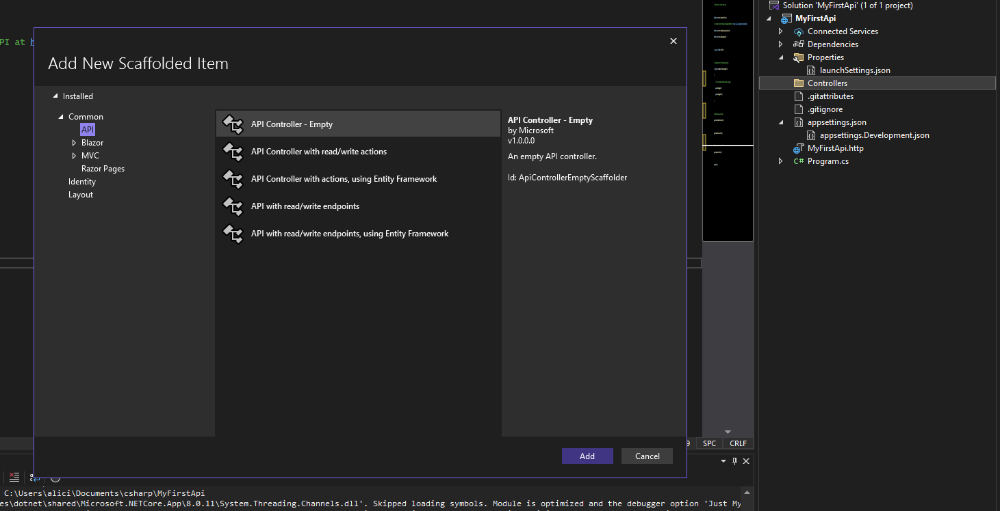

Swagger guia para a API

pode passar informação na chamada de um endpoint de 3 maneiras, pela rota, nos headers e pelo corpo da mensagem
get só aceita pela rota e pelo header